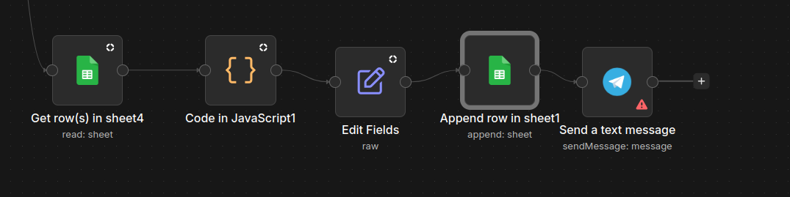

# Flujo de puntuaje de tutorias finalizadas con exito.
---------

## objetivo: 
´´´
    
    Mantener un valance de las tutorias finalizadas del estudiante, mediante el reconocimiento del esfueerzo brindado durante la secion.
´´´

## Descripcion del proyeceto:
-----
**Enfoque: Manipulación de datos matemáticos y actualización de perfiles de usuario.**

**Contexto para el estudiante: La coordinación quiere incentivar la asistencia puntual de los estudiantes a sus tutorías. Por cada tutoría marcada como "Finalizada", el estudiante debe acumular puntos.**

json:
´´´archivo

    
´´´

Autor:
   Brandon Estiben ixen Teleguario.
   Aprendiz junior fullstak.
   ixenbrandonestiben@gmail.com
   
