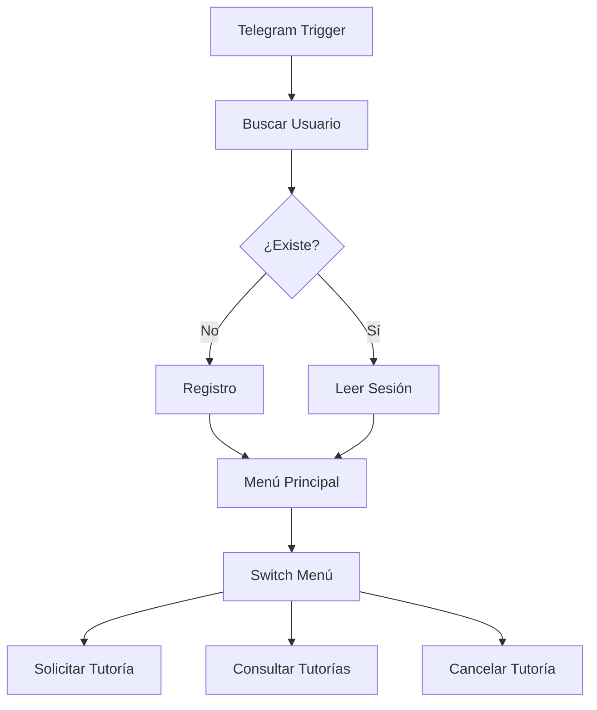
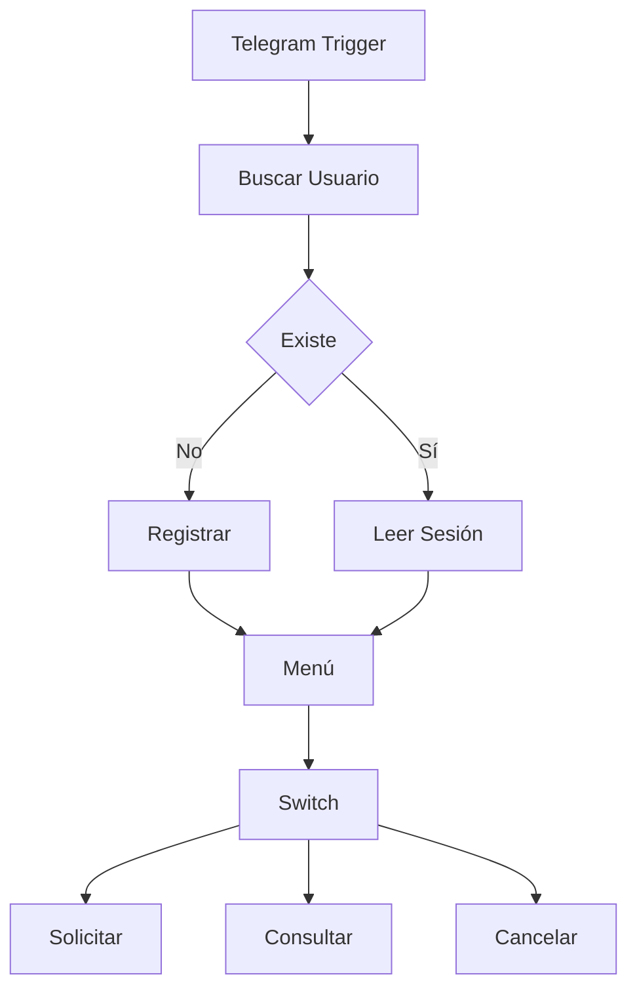
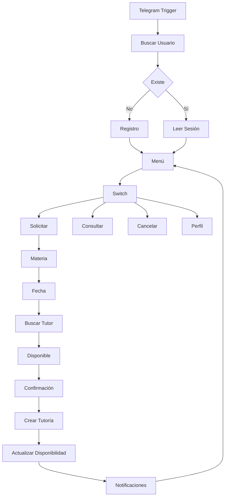

# Proyecto TutorBot - Ixen Estiben y Catu Wilder

# Etapa 1: Configuración Inicial del Proyecto

## Objetivo

En esta primera etapa se realizó la configuración inicial del sistema **TutorBot**, estableciendo la conexión entre los diferentes servicios necesarios para el funcionamiento del bot y organizando la información que será utilizada durante el desarrollo del proyecto.

---

# Actividades realizadas

Durante esta etapa se completaron las siguientes tareas:

- Creación de la base de datos utilizando **Google Sheets**.
- Conexión del bot de **Telegram** con **n8n**.
- Configuración del nodo **IF** para validar el inicio del flujo de trabajo.
- Consulta de los datos del usuario registrados en la base de datos.
- Creación de cuatro botones interactivos que permiten al usuario navegar por las diferentes opciones del sistema.
- Organización de la información correspondiente a los cursos y tutores disponibles.

---

# Flujo de trabajo

## Diagrama del flujo


---

# Explicación del flujo de trabajo

El flujo comienza cuando un usuario envía un mensaje al bot de Telegram.

Actualmente, debido a que el sistema aún no está completamente automatizado, el flujo debe ejecutarse manualmente utilizando los valores:

- **1**
- **2**
- **3**

Estos valores permiten recorrer las diferentes rutas del flujo mientras continúa el desarrollo del proyecto.

> **Nota:** Este procedimiento es temporal y dejará de ser necesario cuando el flujo esté completamente automatizado.

---

## Paso 1. Validación del usuario

Después de recibir el mensaje del usuario, el sistema consulta la base de datos almacenada en **Google Sheets** para verificar si el usuario ya se encuentra registrado.

Existen dos posibles escenarios:

### Usuario registrado

Si el usuario existe en la base de datos:

- El flujo continúa normalmente.
- Se recupera la información del usuario.
- Se inicia su sesión automáticamente.

---
> **Imagen de usuario registrado:**
     

### Usuario no registrado

Si el usuario no existe en la base de datos:

- El sistema redirige al usuario hacia el proceso de registro.
- El usuario completa su información.
- Los datos son almacenados en Google Sheets.
- Una vez finalizado el registro, el flujo continúa normalmente como si el usuario ya estuviera registrado.

---

# Paso 2. Menú principal

Después de validar al usuario automaticamnete rediirge al usuario  la consulta de datos y materias para registrarse y asignarse tuturias.

---

# --------------------------------- Evidencias ------------------------

## Evidencia 1 - Flujo de trabajo

# TutorBot – Sistema de Asesorías Académicas

> **Versión:** 1.0
>
> **Tecnologías**
>
> - n8n
> - Telegram Bot API
> - Google Sheets
> 
>
> Objetivo: Automatizar completamente el proceso de asignación de tutorías utilizando Telegram como interfaz conversacional y n8n como motor de automatización, reduciendo al mínimo el uso del teclado.

---


# Introducción

TutorBot busca automatizar completamente la gestión de asesorías académicas.

Todo el flujo ocurre dentro de Telegram para minimizar el uso del teclado.

El usuario únicamente deberá escribir información cuando sea estrictamente necesario (por ejemplo una fecha), aunque incluso este paso puede eliminarse utilizando botones dinámicos.

---

# Arquitectura General



---

# Arquitectura del Sistema

```text
Telegram
     │
     ▼
Telegram Trigger

     │
     ▼

Google Sheets

     │

     ▼

Motor de Automatización n8n

     │

     ▼

Google Sheets

     │

     ▼

Telegram
```

---

# Base de Datos

## Hoja ESTUDIANTES

| Campo |
|---------|
| id_estudiante |
| telegram_id |
| username |
| nombre |
| apellido |
| correo |
| carrera |
| semestre |
| estado |

---

## Hoja TUTORES

| Campo |
|---------|
| id_tutor |
| nombre |
| especialidad_materias |
| estado |

---

## Hoja DISPONIBILIDAD

| Campo |
|---------|
| id_disponibilidad |
| id_tutor |
| dia_semana |
| hora_inicio |
| hora_fin |
| estado |

Estado

- Libre
- Ocupado

---

## Hoja TUTORIAS

| Campo |
|---------|
| id_tutoria |
| id_estudiante |
| id_tutor |
| materia |
| fecha |
| hora |
| estado |

Estados

- Solicitada
- Asignada
- Confirmada
- Finalizada
- Cancelada

---

## Hoja SESSIONS

| Campo |
|---------|
| telegram_user |
| pantalla_actual |
| paso_actual |
| workflow |
| datos_json |
| ultima_actividad |

---

# Flujo General



---

# Registro de Usuario

## Paso 1

El usuario inicia el bot.

```
/start
```

---

## Paso 2

El bot responde.

```
Bienvenido a TutorBot.

```

---

## Paso 3

Al presionar el botón:

```
callback_data

registrar
```

---

## Paso 4

n8n crea un nuevo registro en Google Sheets.

Posteriormente crea una sesión.

```
pantalla_actual = MENU

paso_actual = 0
```

Finalmente muestra el menú principal.

---

# Menú Principal

Todo el menú utiliza Inline Keyboard.

```
Solicitar Tutoría

Consultar Tutorías

Cancelar Tutoría

Mi Perfil
```

Cada botón devuelve:

| Botón | Callback |
|---------|-----------|
| Solicitar | 1 |
| Consultar | 2 |
| Cancelar | 3 |
| Perfil | 4 |

---

# Configuración del Switch

Entrada

```
{{$json.callback_query.data}}
```

Casos

```
1

Solicitar Tutoría

2

Consultar Tutorías

3

Cancelar Tutoría

4

Perfil
```

---

# Flujo Solicitar Tutoría

## Paso 1

Usuario

```
Solicitar Tutoría
```

↓

Actualizar sesión

```
pantalla_actual

MATERIA
```

---

## Paso 2

Leer materias.

Puede hacerse desde una hoja llamada

```
MATERIAS
```

o leyendo

```
especialidad_materias
```

de la hoja TUTORES.

---

## Paso 3

Mostrar botones.

```
Matemática

Física

Programación

Base de Datos

Inglés
```

---

## Paso 4

Usuario selecciona una materia.

Ejemplo

```
callback

MAT_03
```

Guardar

```
datos_json

{

materia:"Programación"

}
```

Actualizar sesión.

```
pantalla_actual

FECHA
```

---

## Paso 5

Solicitar fecha.

```
Ingrese una fecha

AAAA-MM-DD
```

---

## Paso 6

Validar fecha.

Regex

```
^\d{4}-\d{2}-\d{2}$
```

---

## Paso 7

Guardar fecha.

```
datos_json

{

materia:"Programación",

fecha:"2026-08-10"

}
```

---

## Paso 8

Buscar tutor.

Leer

```
TUTORES
```

Filtrar

```
especialidad

=

Programación

estado

=

Activo
```

Posteriormente consultar

```
DISPONIBILIDAD
```

Buscar

```
estado = Libre
```

---

## Paso 9

Si no existe disponibilidad.

```
No existen horarios disponibles.

[ Elegir otra fecha ]

[ Menú ]
```

---

## Paso 10

Si existe disponibilidad.

Mostrar.

```
Tutor

Carlos Pérez

09:00

Seleccionar
```

---

## Paso 11

Confirmación.

```
Resumen

Materia

Programación

Tutor

Carlos Pérez

Fecha

2026-08-10

Hora

09:00

Confirmar

Cancelar
```

---

## Paso 12

Crear registro.

```
TUTORIAS
```

Estado.

```
Asignada
```

Actualizar disponibilidad.

```
Libre

↓

Ocupado
```

Enviar notificaciones.

- Tutor
- Estudiante

Actualizar sesión.

```
MENU
```

---

# Consulta de Tutorías

Buscar.

```
id_estudiante
```

Leer.

```
TUTORIAS
```

Mostrar.

```
Programación

10 Agosto

09:00

Asignada
```

Botón.

```
Volver
```

---

# Cancelación

Buscar tutorías activas.

Mostrar botones.

```
Cancelar
```

Confirmar.

```
¿Desea cancelar?

Sí

No
```

Actualizar.

```
Estado

Cancelada
```

Actualizar disponibilidad.

```
Ocupado

↓

Libre
```

Enviar notificaciones.

---

# Perfil

Consultar hoja ESTUDIANTES.

Mostrar.

```
Nombre

Carrera

Semestre

Correo
```

---


# Nodos Utilizados

- Telegram Trigger
- Telegram Send Message
- Google Sheets
- Switch
- Edit Fields
- Date & Time
- Code
- Filter

---

# Flujo Completo



---

# flujo final:

> 

# Buenas Prácticas

- Evitar mensajes de texto cuando exista una alternativa con opciones.
- Guardar el estado del usuario después de cada interacción.
- Validar siempre disponibilidad antes de asignar un tutor.
- Utilizar IDs únicos para cada registro.
- Registrar la fecha de última actividad.
- Limpiar datos temporales al finalizar un flujo.

---

# Mejoras Futuras

- Selección de fechas mediante calendario.
- Integración con Google Calendar.
- Recordatorios automáticos.
- IA para responder preguntas frecuentes.
- Reasignación automática de tutores.
- Dashboard para coordinadores.
- Reportes automáticos en PDF.
- Estadísticas de tutorías.
- Confirmación automática 24 horas antes de la cita.

---

# Conclusión

El flujo propuesto permite construir un sistema completamente automatizado en n8n donde el estudiante interactúa casi exclusivamente mediante opciones **1, 2, 3** de Telegram. Esto reduce errores, mejora la experiencia del usuario y simplifica el mantenimiento del flujo al centralizar la lógica en n8n y Google Sheets.

---

# Estado actual del proyecto

En esta primera etapa se logró implementar la estructura principal del sistema, permitiendo:

- La comunicación entre Telegram y n8n.
- La conexión con Google Sheets como base de datos.
- La validación de usuarios registrados.
- El registro de nuevos usuarios.

Sin embargo, el flujo aún no se encuentra completamente automatizado, por lo que algunas pruebas deben ejecutarse manualmente utilizando los valores **1**, **2** y **3**.

Las siguientes etapas del proyecto estarán enfocadas en automatizar completamente el flujo y desarrollar cada una de las funcionalidades disponibles en el menú principal.

---